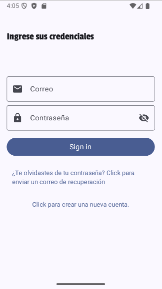
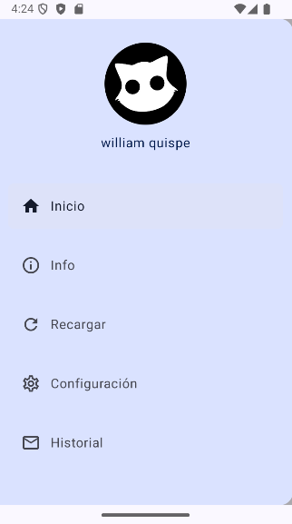
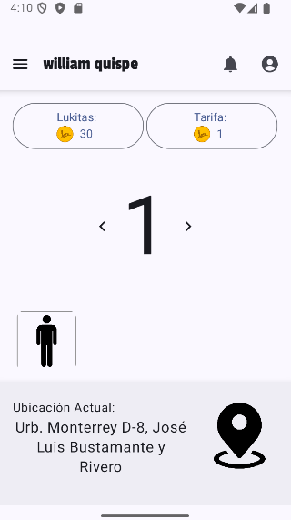
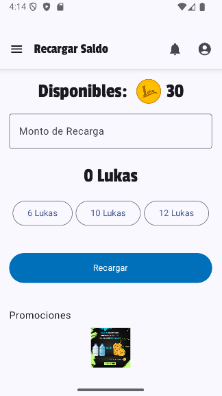
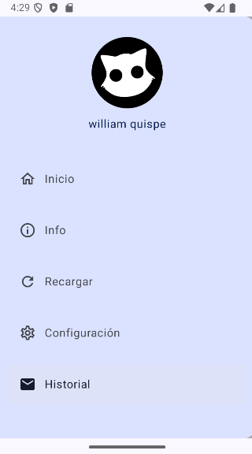
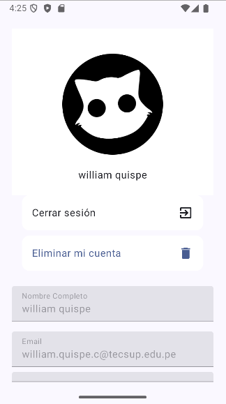

# Luka: Sistema de Pago Automático para Pasajes


**Luka** es una aplicación móvil que facilita el pago automático de pasajes en transporte público mediante una interfaz de usuario moderna y fluida. Desarrollada en Kotlin con Jetpack Compose, la aplicación permite gestionar pagos seguros, autenticación de usuarios y realizar seguimientos de las transacciones.

## Características Principales

- **Interfaz de Usuario Moderna**: Construida con Jetpack Compose, proporcionando una interfaz rápida, eficiente y completamente nativa para una experiencia de usuario superior.
- **Autenticación Firebase**: Los usuarios pueden autenticarse de forma segura mediante Firebase Authentication, asegurando una experiencia confiable y personalizada.
- **Historial de Transacciones**: Los usuarios pueden consultar y gestionar un historial completo de pagos realizados a través de la aplicación.
- **Notificaciones en Tiempo Real**: Integración con Firebase para enviar notificaciones a los usuarios cuando se realicen pagos o se detecten errores.
- **Inyección de Dependencias con Hilt**: Se utiliza Hilt para la inyección de dependencias, facilitando la modularización del código y mejorando la escalabilidad del proyecto.
- **Animaciones de Confeti**: Se implementan animaciones interactivas usando la librería Konfetti para mejorar la experiencia al completar transacciones.
- **Pago con PayPal**: La aplicación soporta pagos mediante PayPal SDK, asegurando transacciones rápidas y seguras.

## Tecnologías Utilizadas

- **Kotlin**: Lenguaje principal para el desarrollo de la aplicación móvil.
- **Jetpack Compose**: Framework para crear interfaces de usuario de manera declarativa y modular.
- **Firebase**: Proporciona servicios como Firebase Authentication (autenticación de usuarios), Firebase Firestore (base de datos en tiempo real), y Firebase Crashlytics (monitoreo de errores).
- **Hilt**: Framework de inyección de dependencias para facilitar la gestión de servicios y mejorar la arquitectura del proyecto.
- **PayPal SDK**: Para gestionar pagos mediante la plataforma PayPal.
- **Konfetti**: Para agregar animaciones de confeti cuando se completa un pago.
- **Moshi**: Para la gestión y serialización de datos en formato JSON.
- **Coroutines**: Para gestionar operaciones asíncronas y tareas en segundo plano de manera eficiente.

## Uso de Luka

La estructura del proyecto se organiza de la siguiente manera:

- **Registro de Usuario**: Los usuarios se registran con su nombre, correo y contraseña usando Firebase Authentication, y luego pueden acceder para realizar pagos.
  


- **Lista de opciones**: Los usuarios pueden seleccionar diferentes opciones disponibles en la aplicación, como realizar pagos, ver el historial o gestionar su perfil.
  


- **Menu de pago**: Los usuarios pueden administrar el numero de pasajes a pagar tambien ver la tarifa y saldo.
  


- **Saldo disponible y recargar**: Los usuarios pueden ver su saldo actual y recargarlo utilizando métodos de pago disponibles, como PayPal.
  


- **Historial de pagos**: Los usuarios pueden consultar un registro de todos los pagos realizados a través de la aplicación.
  


- **Configuracion de perfil**  : Los usuarios pueden actualizar su información personal tambien cambiar su contraseña desde la aplicación y si desea darse de baja.
- 


## Instalación

1. Clona el repositorio:

   ```bash
   https://github.com/Zamata/APPLuka/tree/main
2. Abre el proyecto en **Android Studio**.

3. Instala las dependencias necesarias:

   ```bash
   build.gradle
4. Ejecuta la aplicación en tu Android studio.

## Contribuciones

Si deseas contribuir a este proyecto, sigue estos pasos:

1. Proyecto para contribuir.

   ```bash
   https://github.com/Zamata/APPLuka/tree/main
2. Crea una nueva rama para tus cambios:

   ```bash
   git checkout -b feature/nueva-característica

3. Realiza tus cambios y haz commit:

   ```bash
   git commit -am 'Añadir nueva característica'

4. Push a tu rama:

   ```bash
   git push origin feature/nueva-característica


5. Crea un Pull Request.

## Licencia

Este proyecto está bajo la licencia **MIT**. Consulta el archivo [LICENSE](LICENSE) para más detalles.
